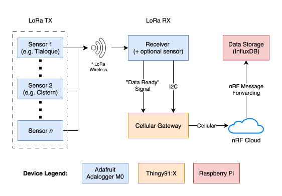

## Rainwater Harvesting Sensing System - V3
____

### Block Diagram

### Repository Organization

There is a folder for each *device*, where its corresponding software and documentation/instructions lie:

- Sensor TX/RX software can be found in [./adalogger-m0](./adalogger-m0) 
- Cellular gateway software can be found in [./nrf-thingy-91x](./nrf-thingy-91x)
- Data Storage software can be found in [./raspberry-pi](./raspberry-pi)